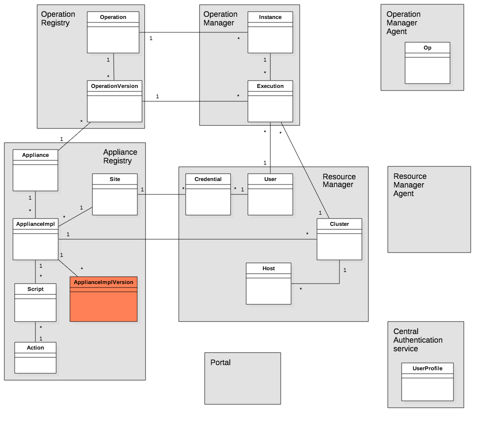

# DIBBS-Architecture-Demo

Operations management platform that combines access to data and computation within one geospatial portal. More details can be found in the following paper [docs/publishing_platform_for_geospatial_operations.pdf](https://github.com/DIBBS-project/DIBBS-Architecture-Demo/blob/master/docs/publishing_platform_for_geospatial_operations.pdf).

## TLDR;

### Deploy
Run one of following commands to setup the DIBBs platform

```shell
sudo bash deploy_with_docker.sh
```

or

```shell
sudo bash deploy_without_docker.sh
```

Wait that the deployment is finished (give to the system one or two minutes).

### Run on roger

> Don't forget to update the *infrastructure_description_roger.json* file with your account information

run the following "one liner" script:

```
bash onliner_init_script.sh --run-on-roger
```

### Run on chameleon (baremetal)

> Don't forget to update the *infrastructure_description_chameleon.json* file with your account information

run the following "one liner" script:

```
bash onliner_init_script.sh
```

## Installation and run

### Without Docker

> *This method will modify the configuration of the computer, you should run it inside a virtual machine or on a testing computer. If you plan to do testing on your own computer, please consider following the "With Docker" instructions.*

Run the following command:

```shell
sudo bash deploy_without_docker.sh
```

It will install the following software:
- screen
- pip
- redis-server

and the following python packages:
- keystoneauth1
- keystonemiddleware
- python-keystoneclient
- redis
- celery

### With Docker

Run the following command:

```shell
sudo bash deploy_with_docker.sh
```

It will install the following software:
- docker

## Bootstraping

To bootstrap a newly deployed DIBBs platform (give one or two minutes to the system to run), you will have to do the following actions:

- configure cloud computing infrastructures that will be used to run operation executions
- add some appliances that describes environment in which are run operations

### Configure cloud computing infrastructures and credentials

#### Add a cloud computing infrastructure and credentials

Cloud computing infrastructures and credentials are described in JSON format files. We have included two examples:

| Cloud infrastructure | type | Description file |
| -------------------- | ------------- | ---|
| Chameleon  | OpenStack (bare-metal) | infrastructure\_description\_chameleon.json  |
| Roger  | OpenStack (KVM) |infrastructure\_description\_roger.json |

To add a Cloud Computing infrastructure to an existing DIBBs platform, run the following command (Roger):

```shell
python create_os_users.py infrastructure_description_roger.json
```

#### Description of cloud computing and credentials

```javascript
{
  "credentials": [
    {
      "name": "kvm@roger_dibbs",
      "username": "<username>",
      "project_name": "<project_name>",
      "flavor": "standard",
      "infrastructure": "kvm@roger"
    }
  ],
  "infrastructures": [
    {
      "name": "kvm@roger",
      "contact_url": "http://roger-openstack.ncsa.illinois.edu:5000/v2.0",
      "type": "openstack"
    }
  ]
}
```

### Add appliances

Appliances are a description of a software environment in which operations will be run. Implementation of appliances is based on Heat (OpenStack). In this project, we provide an hadoop appliance which has been used for examples.

To add this hadoop appliance, run the following command:

```shell
python create_appliances.py infrastructure_description_roger.json
```

## Running an example

We provide a small example of a "line counter" operation.


## Architectural annexes

### Concepts


